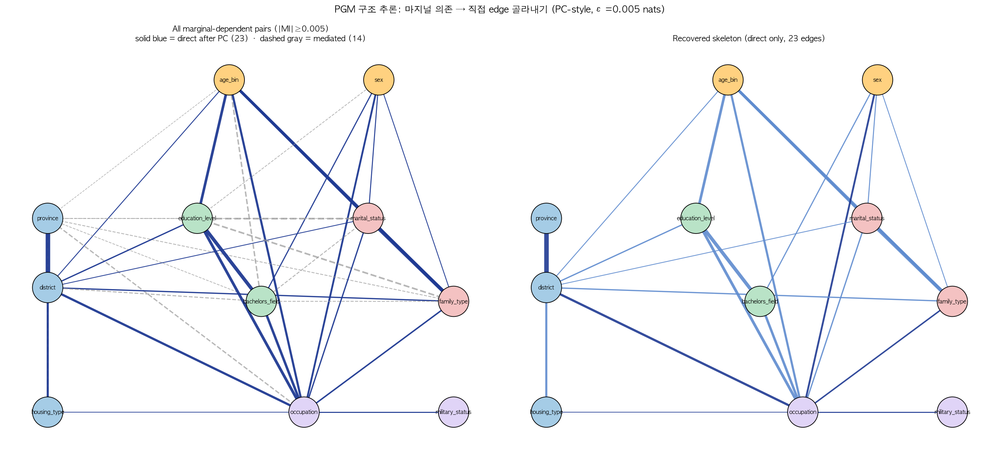

# Nemotron-Personas-Korea — 데이터셋 감사 (Audit)

> 2026년 4월, NVIDIA가 *700만 한국인 가상 페르소나* 라는 이름으로 공개한 합성 데이터셋이
> 통계적으로 얼마나 실제 한국 인구를 닮았고, 내부적으로 어떤 구조를 갖는지를
> **데이터 자체에서** 검증한 독립 분석 리포지터리입니다.

[](LICENSE)
[](LICENSE)
[](https://huggingface.co/datasets/nvidia/Nemotron-Personas-Korea)

---

## 📋 한 페이지 요약

NVIDIA가 공개한 [Nemotron-Personas-Korea](https://huggingface.co/datasets/nvidia/Nemotron-Personas-Korea)
는 한국 통계청·대법원·국민건강보험공단 등의 공식 통계를 바탕으로 만든 **1,000,000행 × 26개 변수**의
합성 페르소나 데이터입니다. 데이터 카드에는 단변량 (marginal) 분포의 정성적 비교만 공개되어 있어,
**연구자가 이 데이터를 자기 분석에 써도 될지 판단할 근거**가 부족했습니다.

본 리포는 3단계로 정량 검증을 수행했습니다.

| Phase | 무엇을 봤나 | 결과 |
|---|---|---|
| **1** 단변량 충실도 | 12개 변수의 분포가 KOSIS 와 일치하나? | sex/지역/학력/혼인 모두 양호 (TVD ≤ 0.05). 단 **housing 만 격차** (TVD=0.12) |
| **2** 이변량 결합 | 55개 변수 쌍의 결합이 어떤 모양인가? | 인구학 chain (age→marital→family, age→edu→field→occupation) 견고. 성별×전공 분리 패턴 한국 현실과 부합 |
| **3** 의존 구조 추정 | 데이터에 어떤 조건부 의존 skeleton이 남아있나? | **23 direct + 14 mediated + 18 no-edge** (ε=0.005 nats, \|Z\|≤2 조건 하; ε 100배 변동 시 direct 수 32–13 범위, 핵심 결론은 ε-stable; permutation null 로 bias 보정 시 12개만 ratio>2 로 견고). **Housing은 사람 속성과 분리, military는 occupation 함수** |

### ⭐ 5개 결정적 발견

1. ✅ **시도/시군구별 인구 분포는 KOSIS 와 매우 가까움** — TVD = 0.005, 17개 시도 모두 ±0.24pp 이내.
2. ✅ **인구학 chain (나이→결혼→가족, 나이→학력) 한국 현실과 정량적으로 부합** — 20-50대 미혼 비율이 2020 census 와 8/8 cell 모두 ±4pp 이내 (P7 외부 검증). 25-34 4년제 51.6%, 75-84 사별 42.6% 등 KOSIS 와 일치.
3. ✅ **성별×전공 분리 패턴 한국 현실과 부합** — 공학 86% 남성, 보건·복지 28% 남성.
4. ⚠️ **`housing_type` 이 사람 속성과 통계적으로 분리됨** — 1인 가구도 4인 가족도 청년도 노년도 모두 아파트 ~62%. 예측 기반 conditional-independence probe 로 이중 확인 (info_added = −0.008 nats).
5. ⚠️ **`military_status` 는 occupation 라벨에서 거의 결정적으로 파생되는 부수 변수** (정보 중복). 단 변수 의미는 *의무복무 이행* 이 아니라 *현역 군 인력 신분 (직업군인 + 의무복무 통합)* 으로 한국군 인력 구성과 부합 (병사 평균 25세, 부사관 41세, 장교 47세, 여성 11%).

→ **결론**: LLM 학습용 페르소나로는 우수. **개인 속성별 주거 분석·의무복무 흐름 분석에는 부적합**, **지역 단위 시뮬레이션·인구학 chain·현역 군 인력 구성 분석에는 사용 가능**.

---

## 🧭 어디부터 읽으면 좋은가

| 당신은 ... | 가세요 |
|---|---|
| 5분 안에 핵심만 알고 싶다 | 위 "한 페이지 요약" 만 읽기 |
| 내 연구에 이 데이터 써도 될지 결정해야 한다 | [`docs/RESEARCHER_GUIDE.md`](docs/RESEARCHER_GUIDE.md) |
| 통계 용어 (CMI, NMI, TVD…) 가 어렵다 | [`docs/GLOSSARY.md`](docs/GLOSSARY.md) |
| 자주 묻는 질문이 있다 | [`docs/FAQ.md`](docs/FAQ.md) |
| 어느 보고서를 어디서 보나 | [`docs/READING_GUIDE.md`](docs/READING_GUIDE.md) |
| 분석 방법론을 자세히 보고 싶다 | [`docs/METHODOLOGY.md`](docs/METHODOLOGY.md) |
| 직접 재현하고 싶다 | [`#재현`](#재현) |
| **이 분석 자체를 의심한다 / 다른 LLM으로 검증하고 싶다** | [`review/`](review/) |

---

## 📊 데이터셋 정보 (NVIDIA 공식 자료 기준)

| 항목 | 내용 |
|---|---|
| 이름 | Nemotron-Personas-Korea |
| 제작 | NVIDIA Corporation |
| 공개 | 2026-04-20, [HuggingFace](https://huggingface.co/datasets/nvidia/Nemotron-Personas-Korea) |
| 라이선스 | CC BY 4.0 |
| 행 수 | **1,000,000** (페르소나 텍스트 7종 × 1M = "약 700만 페르소나" 마케팅) |
| 토큰 | ~17억 |
| 변수 | 26개 (인구통계·지리 12 + 자유서술 페르소나 7 + 속성 6 + UUID) |
| 모집단 | 19세 이상 한국 성인 |
| 생성 도구 | [NVIDIA NeMo Data Designer](https://github.com/NVIDIA-NeMo/DataDesigner) |
| 생성 모델 | Probabilistic Graphical Model (인구통계) + `google/gemma-4-31B-it` (자연어) |
| 시드 통계 | KOSIS, 대법원(이름), NHIS 건강검진, KREI 식품소비, 네이버클라우드 |

---

## 🗂️ 분석 결과 — Phase별

### [Phase 1 — 단변량 충실도](reports/PHASE1_REPORT.md)

각 변수의 분포가 KOSIS / 통계청 공식 통계와 얼마나 일치하는가.

- 12개 변수의 분포 산출 → [`data/processed/marginals/`](data/processed/marginals)
- 5개 핵심 변수에 대한 KOSIS 비교 → [`reports/tables/kosis_comparison.md`](reports/tables/kosis_comparison.md)
- **Headline**: sex (TVD=0.0006), province (0.005), education (0.04), marital (0.05) 모두 양호. **housing (0.12) 만 신호** (아파트 +9pp, 단독 −12pp).

### [Phase 2 — 이변량 결합](reports/PHASE2_REPORT.md) · [전 55페어 색인](reports/PAIR_INDEX.md)

55개 변수쌍의 결합 분포를 **모두** 4개 지표 (Cramér V, NMI, Theil U, TVD vs independence) 로 측정 + 각 페어에 3-panel 시각화.

- 4개 11×11 heatmap → [`reports/figures/heatmap_*.png`](reports/figures)
- 55개 페어 detail → [`reports/figures/bivariate_all/`](reports/figures/bivariate_all)
- 본문 깊이 다룬 10개 → [`reports/figures/bivariate/`](reports/figures/bivariate)

### [Phase 3 — 의존 구조 추정](reports/PHASE3_REPORT.md) ⭐

Conditional MI 와 PC-style 알고리즘으로 데이터에 남아있는 **조건부 의존 skeleton 을 추정** (NVIDIA 의 proprietary PGM 진짜 그래프 자체의 복원이 아님 — ε=0.005 nats, \|Z\|≤2 한계 하의 추정치).



- 495개 CMI 계산 → [`data/processed/cmi/cmi_long.csv`](data/processed/cmi/cmi_long.csv)
- 추론된 skeleton (23 direct edges) → [`data/processed/cmi/skeleton.json`](data/processed/cmi/skeleton.json)
- ε threshold sensitivity (7 grid 값) → [`data/processed/cmi/epsilon_counts.csv`](data/processed/cmi/epsilon_counts.csv)
- Permutation null + bootstrap CI (bias-corrected significance) → [`data/processed/cmi/permutation_null_*.csv`](data/processed/cmi)
- KOSIS cross-tab 외부 비교 (age×marital, age×sex×edu, province×housing) → [`data/processed/kosis_joint_compare.json`](data/processed/kosis_joint_compare.json)
- 예측 기반 decoupling probe → [`data/processed/decoupling_probe.json`](data/processed/decoupling_probe.json)
- 5-seed subsample stability (52/55 stable) → [`data/processed/cmi/stability.csv`](data/processed/cmi/stability.csv)

### Phase 4 (예정) — 자유서술 페르소나 텍스트
7개 텍스트 필드의 어휘 다양성 / 고정관념 / 성별·연령별 텍스트 일관성 분석. 미진행.

---

## 🔬 재현

### 환경
```bash
git clone <this-repo>
cd nemotron-personas-korea-audit
uv venv .venv && source .venv/bin/activate
uv pip install -r requirements.txt
```

### 데이터 다운로드 (~2GB)
```bash
python scripts/01_download.py
```

### Phase별 실행
```bash
# Phase 1 — 단변량
python scripts/02_marginals.py
python scripts/03_compare_kosis.py

# Phase 2 — 이변량
python scripts/04_bivariate_metrics.py     # 55 pair metric matrices
python scripts/05_bivariate_detail.py      # 본문 큐레이션 10개 detail
python scripts/05b_bivariate_detail_all.py # 전 55개 페어 detail
python scripts/06_build_pair_index.py      # PAIR_INDEX.md

# Phase 3 — PGM 구조
python scripts/07_cmi_sweep.py             # 495 CMIs (~3분)
python scripts/08_skeleton_recovery.py     # PC-style with |Z|≤2 (~5분)
python scripts/09_network_viz.py
python scripts/10_three_way_viz.py
python scripts/11_decoupling_probe.py      # decoupling probe (~3분)
python scripts/12_subsample_stability.py   # 5 seeds (~6분)
python scripts/14_epsilon_sensitivity.py   # ε grid (즉시)
python scripts/15_permutation_null.py      # 100 perms × 78 pairs (~25분)
python scripts/16_bootstrap_ci.py          # 100 boots × 78 pairs (~5분)
python scripts/17_perm_boot_viz.py         # 4 figures
python scripts/18_kosis_joint_compare.py   # KOSIS cross-tab 외부 비교 (즉시)
```

총 실행 시간: ~30분 (M-series Mac 기준).

---

## 📁 디렉토리 구조

```
.
├── README.md                   ← 현재 보고 계신 문서
├── LICENSE                     ← MIT (코드) + CC BY 4.0 (분석/리포트)
├── CITATION.cff                ← 인용 메타데이터
├── CONTRIBUTING.md
├── requirements.txt
│
├── docs/                       ← 친절 문서 (비전문가용 포함)
│   ├── READING_GUIDE.md        ← 어디부터 읽으면 좋은가
│   ├── GLOSSARY.md             ← 용어집 (CMI/NMI/TVD/PMI/PGM 등)
│   ├── FAQ.md                  ← 자주 묻는 질문
│   ├── RESEARCHER_GUIDE.md     ← 사용 가능/부적합 결정 가이드
│   └── METHODOLOGY.md          ← 방법론 종합
│
├── reports/                    ← 분석 리포트 (CC BY 4.0)
│   ├── PHASE1_REPORT.md        ← 단변량 충실도
│   ├── PHASE2_REPORT.md        ← 이변량 결합
│   ├── PHASE3_REPORT.md        ← PGM 구조 추론
│   ├── PAIR_INDEX.md           ← 55페어 색인
│   ├── tables/
│   └── figures/                ← 모든 그림
│
├── review/                     ← 외부 모델 리뷰용 패키지
│   ├── REVIEW_PACKET.md        ← 단일 파일에 방법론+결과 모두 (모델에 붙여넣기용)
│   ├── CLAIMS_LEDGER.md        ← 모든 주장에 번호 + 증거 링크
│   ├── REVIEW_PROMPTS.md       ← 4종 미리 작성된 리뷰 프롬프트
│   └── key_results.json        ← 핵심 수치 구조화 (검증용)
│
├── scripts/                    ← 재현 코드 (MIT)
│   ├── 01_download.py ~ 18_kosis_joint_compare.py
│   ├── _lib.py                 ← 공통 유틸 (load_df, metrics)
│   ├── _cmi.py                 ← CMI 계산 모듈
│   └── build_review_packet.py  ← review/ 자동 빌드
│
├── data/
│   ├── raw/                    ← gitignore (대용량). 01_download.py 로 받음
│   ├── reference/              ← KOSIS reference (작은 JSON, commit)
│   └── processed/              ← 분석 산출물 (작은 CSV/JSON, commit)
│
├── notebooks/                  ← (현재는 비어있음)
└── .github/                    ← issue templates, PR templates
```

---

## 🤝 기여 / 외부 리뷰

본 리포에 가장 가치 있는 기여는 **결과 정정 / 방법론 개선** 입니다.
- 일반 기여: [`CONTRIBUTING.md`](CONTRIBUTING.md)
- 앞으로 할 작업: [`ROADMAP.md`](ROADMAP.md) (P3-P9 우선순위)
- **외부 LLM 리뷰**: [`review/REVIEW_PROMPTS.md`](review/REVIEW_PROMPTS.md) 의 프롬프트로 GPT/Gemini/다른 Claude 등에 검증을 시켜본 뒤 issue (`external-review` 라벨) 로 결과 공유

---

## ⚖️ 라이선스 / 면책

- **코드** (`scripts/`, `*.py`): MIT
- **분석 리포트와 그림** (`reports/`, `data/processed/`): CC BY 4.0
- **분석 대상 데이터** (`nvidia/Nemotron-Personas-Korea`): NVIDIA의 자산, CC BY 4.0
- **KOSIS reference**: 통계청·행안부 등 발행 기관의 공공누리

본 리포는 **NVIDIA와 무관한 독립 학술 검증** 입니다. 데이터셋의 우열을 단정하지 않으며,
사용자가 적절한 사용 범위를 판단할 수 있도록 정량 정보를 제공할 뿐입니다.
NVIDIA가 본 결과를 정정하거나 보강하면 환영합니다.

---

## 📚 인용

논문·보고서에서 본 감사를 인용하실 때:

```bibtex
@software{kim_nemotron_personas_korea_audit_2026,
  author = {Kim, Chang-Eop},
  title = {Nemotron-Personas-Korea Audit: Independent Statistical Audit
           of NVIDIA's Korean Synthetic Persona Dataset},
  year = {2026},
  url = {https://github.com/eopchang/nemotron-personas-korea-audit},
  license = {MIT (code), CC BY 4.0 (reports)},
}
```

GitHub의 "Cite this repository" 버튼 (`CITATION.cff`) 도 사용 가능.

---

## 🙏 사사

- NVIDIA Corporation: 이 데이터셋을 CC BY 4.0 으로 공개해 외부 검증을 가능케 한 점
- 통계청 / 행정안전부 / 국민건강보험공단 / 한국농촌경제연구원: 시드 공공 통계
- 본 분석은 [Theoretical Neuroscience & Computational Medicine Lab, 가천대학교](https://www.gachon.ac.kr) 에서 수행
