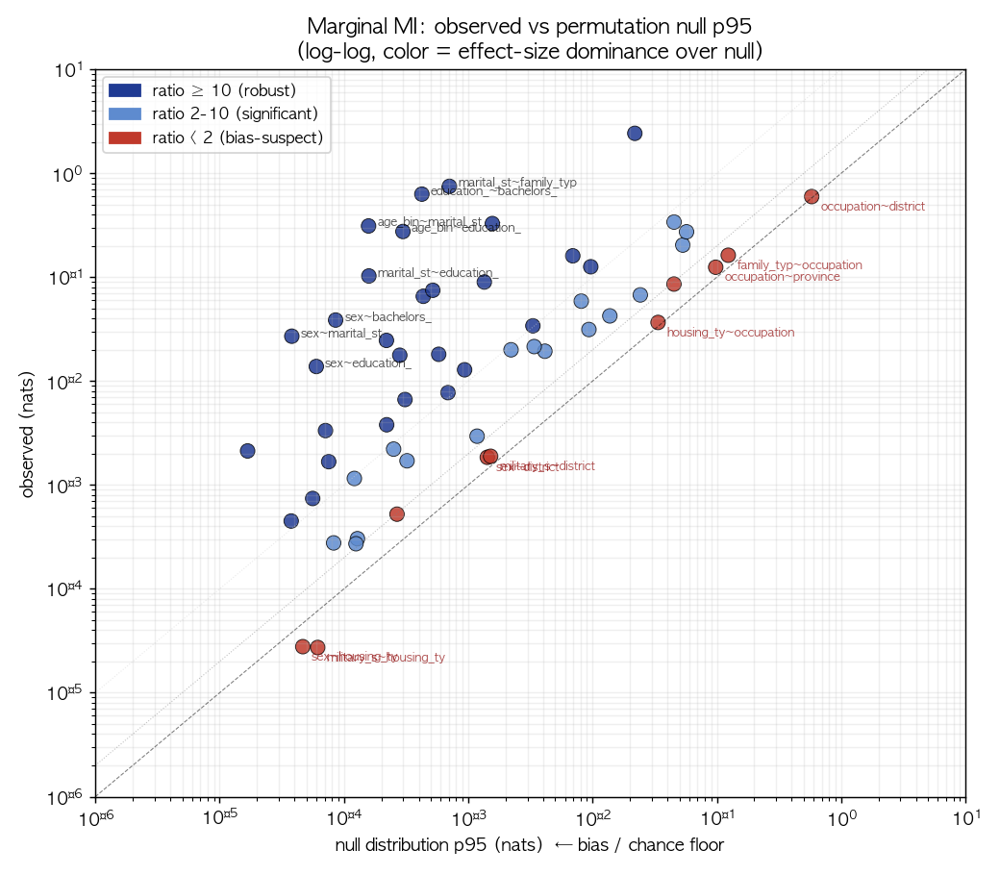
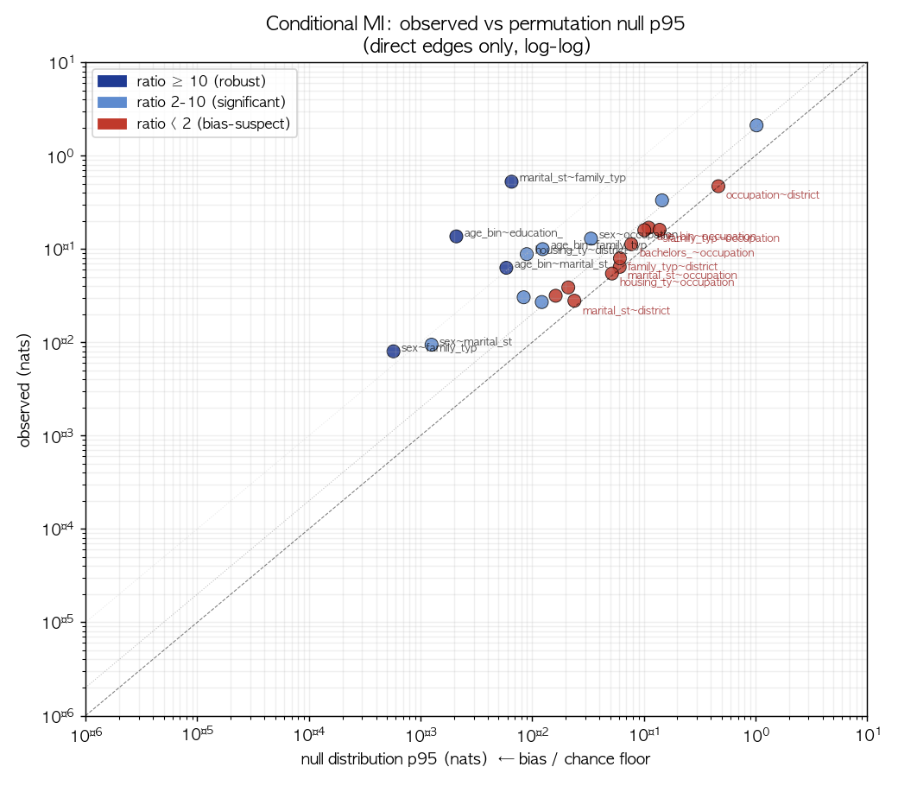
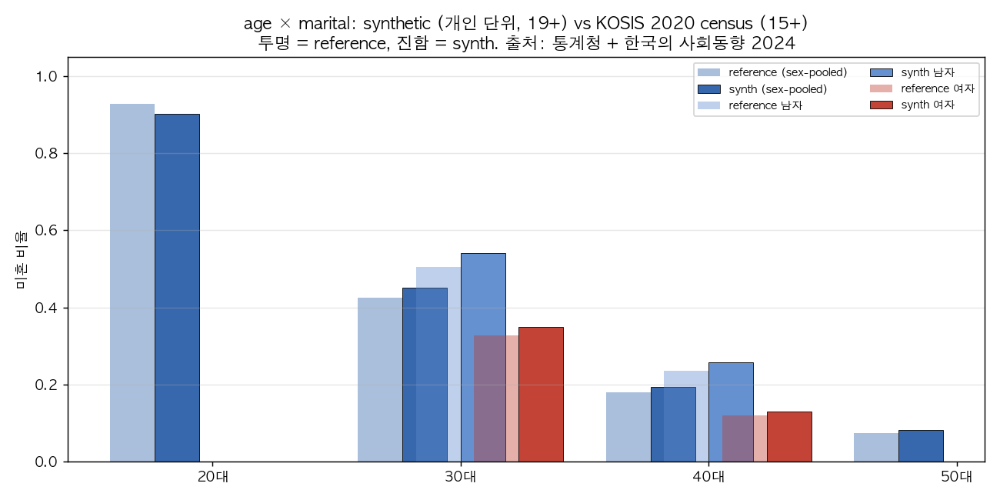
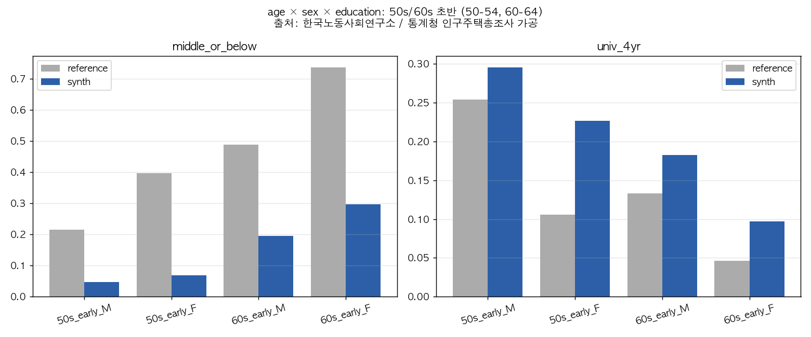
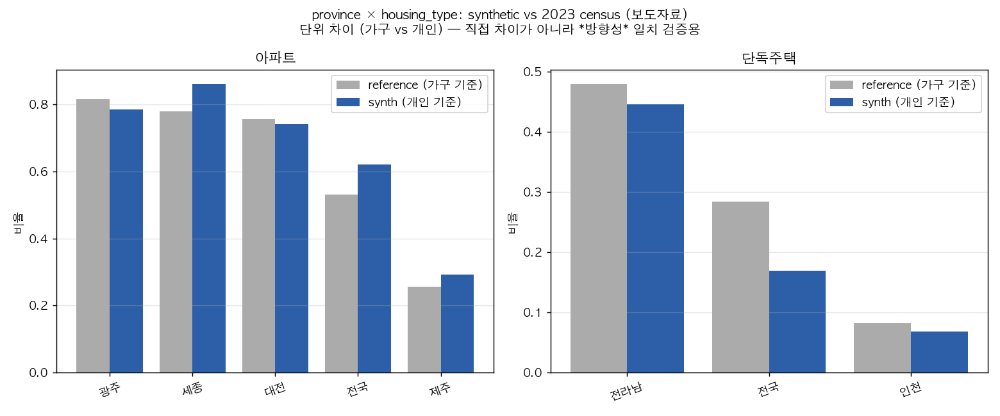
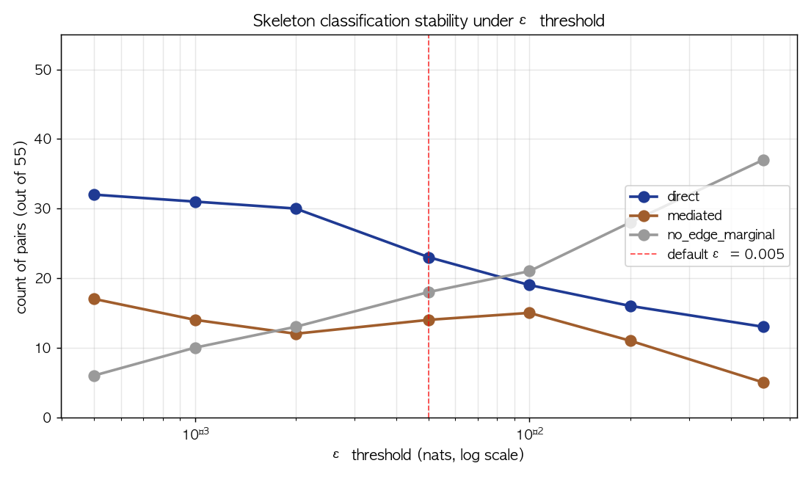
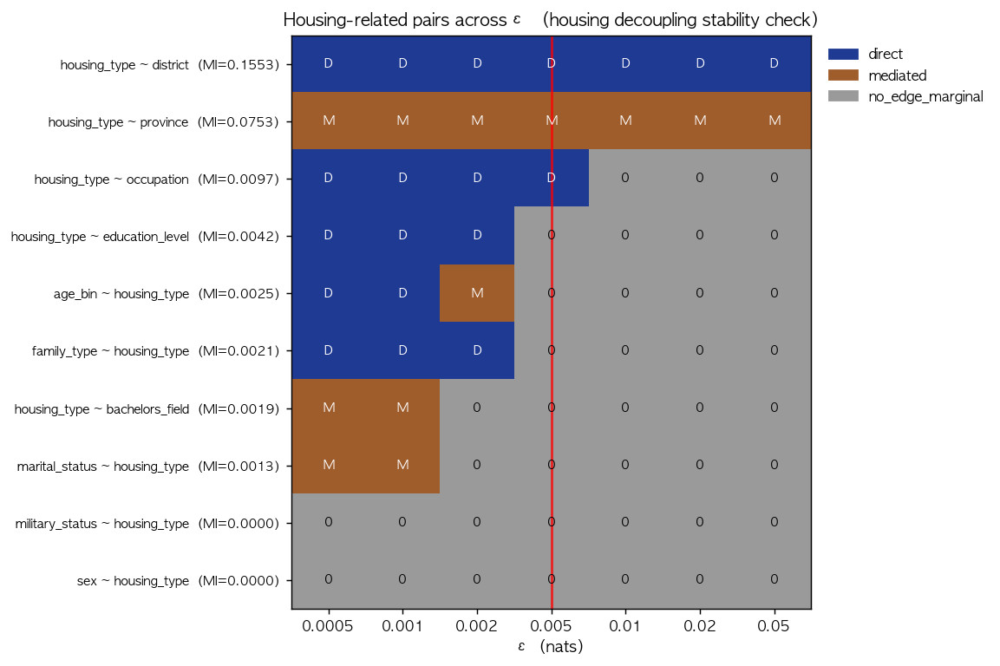
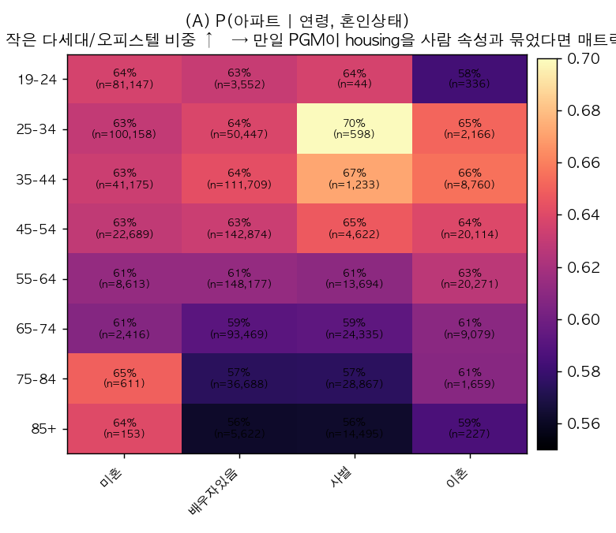
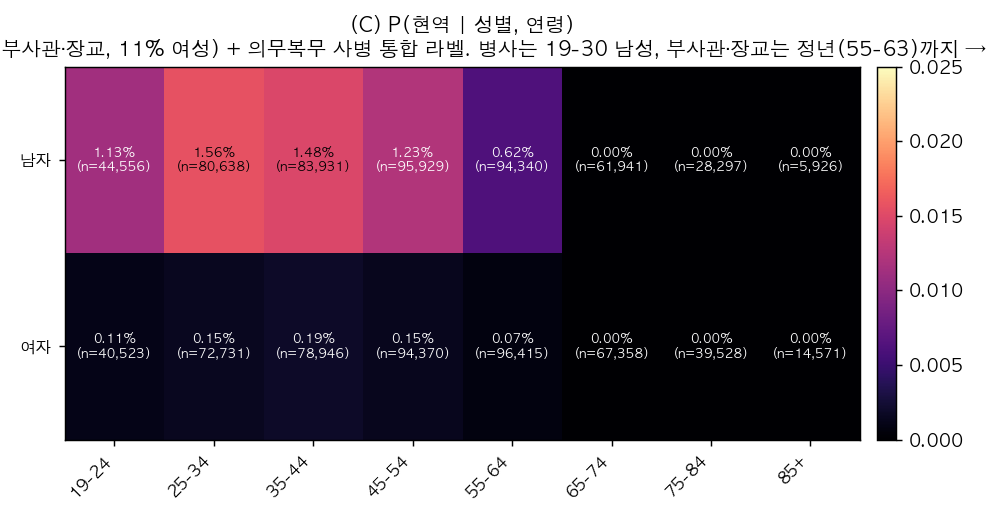

# Phase 3 — PGM 구조 추론 (Conditional MI · Skeleton · 합성-내 예측가능성 검사)

> **한 문단 요약**: Conditional MI 와 PC-style 알고리즘으로 PGM이 생성한
> 데이터에서 *관찰되는 조건부 의존 skeleton* 을 추정. 결과: **23 direct + 14 mediated
> + 18 no-edge** (단, ε=0.005 nats, |Z|≤2 한계 하; permutation null 로 bias 보정 시
> 12개만 ratio>2 로 견고). 가장 결정적 발견: **`housing_type` 은 사람 속성과
> 통계적으로 분리됨** — 분류기로 person-attrs 추가 정보 = -0.008 nats (실질 0).
> 1인 가구도 4인 가족도 모두 같은 주거 분포. `military_status` 는 occupation 라벨에서
> 거의 결정적으로 파생되는 부수 변수이며, 변수 의미는 "현역 군 인력 신분
> (직업군인 + 의무복무 통합)" 으로 한국군 인력 구성과 부합.

NVIDIA `Nemotron-Personas-Korea` 가 사용한 PGM이 생성한 데이터에서 **관찰되는 조건부 의존 skeleton**을 역공학적으로 추정한다.

> ⚠️ 본 분석은 NVIDIA의 proprietary PGM 그래프 자체의 복원이 아니라, **공개 데이터에 남아있는 조건부 의존 구조의 근사** 이다. 생성 파이프라인은 PGM 외 LLM 텍스트 생성·필터링·후처리를 포함하며, 관찰 데이터에서 추론한 skeleton 은 conditioning depth, threshold, latent variable 가정에 의존한다.
>
> Phase 2 결론: marginal·bivariate 결합은 풍부하지만, 두 변수가 강하게 결합돼 보여도 직접 edge인지(아니면 다른 변수를 통한 매개인지) 모른다.
> Phase 3 결론: **23개 direct + 14개 mediated + 18개 marginal 독립의 skeleton** 을 PC-style 추론으로 추정했다 (단, ε=0.005 nats · \|Z\|≤2 한계 하의 결과로, "direct" = "현 조건 하에서 매개되지 않은 잔존 의존"). Housing은 district 외 사람 속성과 거의 독립이라는 가설을 **합성-내 예측가능성 검사** (분류기로 정보 추가량 측정) 로도 정량 확인 (person-attrs 정보 추가 = −0.008 nats, 즉 0).

---

## 1. 방법

### 1.1 Conditional Mutual Information (CMI)

```
I(X; Y | Z) = Σ_{x,y,z} p(x,y,z) · log [ p(x,y,z) · p(z) / (p(x,z) · p(y,z)) ]
```

해석: Z를 알 때 X와 Y의 결합 정보. 만약 X⊥Y|Z (Z가 매개) 라면 CMI ≈ 0.
모든 MI / CMI 단위는 **nats**.

### 1.2 PC-style skeleton recovery

각 페어 (X, Y) 에 대해:

1. **Level 0** — marginal MI `I(X;Y)` 계산
2. **Level 1** — `I(X;Y|Z)` for every other Z (단일 변수 조건)
3. **Level 2** — `I(X;Y | Z*, Z')` for every Z' (Z* = level-1 best mediator + 한 변수 더)
4. **분류**:
    - `no_edge_marginal` — 마지널부터 < ε
    - `mediated`        — 어떤 conditioning 에서든 < ε 으로 떨어짐
    - `direct`          — 어떤 conditioning 으로도 ε 위에 머무름

ε = **0.005 nats** (효과크기 임계, N=1M 에서 χ² p-value는 의미 없음)

### 1.3 합성-내 예측가능성 검사 (within-synthetic predictability check)

> 용어 주의: 본 검사는 합성 데이터를 train/test split 한 **within-synthetic** 비교다. 엄밀한 TSTR (Train on Synthetic, *Test on Real*) 과 다르므로 "합성-내 예측가능성 검사 (within-synthetic predictability check)" 명칭을 사용한다. 파일·함수명에는 초기 명칭 `decoupling_probe` 가 그대로 남아 있다 (외부 참조 안정성 위해 유지).

분류기로 정보 추가량을 측정:
```
Info_added(features → target | baseline) = CE(target | baseline) − CE(target | baseline + features)
```
- 0 에 가까우면 features는 target에 conditional independent (decoupled)
- 큰 양수면 features가 baseline 위에 정보를 더함

`HistGradientBoostingClassifier`, 200K subsample, 80/20 train/test, ε-feature 컷오프 = 250 (HGB cardinality 제한).

### 1.4 Leakage check — 위 probe 결과는 데이터 누수에 영향받았나?

`scripts/11_decoupling_probe.py` 의 잠재적 leakage 6가지 (encoder 전체 fit, cap_high_card 전체 빈도 기반, target encoding, 단일 split, HGB 내부 split, 합성 데이터 row 중복성) 을 식별 후, **train-only encoder + train-only cap + 5-fold CV** 로 재실행 ([`scripts/11b_decoupling_probe_no_leakage.py`](../scripts/11b_decoupling_probe_no_leakage.py)).

| Case | 원본 info_added | Leakage-corrected | 차이 |
|---|---:|---:|---:|
| **Q1 housing decoupled** | **−0.0077** | **−0.0082** | −0.0006 |
| C1 family_type control | +0.8175 | +0.8159 | −0.0015 |
| C2 occupation control | +0.1809 | +0.1769 | −0.0041 |
| Q2 military\|age+sex | +0.0020 | +0.0019 | −0.0001 |
| Q3 military\|sex+age+occ | +0.0225 | +0.0236 | +0.0012 |
| C3 marital control | +0.5530 | +0.5518 | −0.0012 |

→ **모든 차이 < 0.005 nats** (측정 효과의 1% 이하). 5-fold CV 표준오차 SE < 0.02 nats.
**결론 변화 없음** — leakage 우려는 valid 했으나 실제 영향은 무의미.

### 1.5 Subsample stability

5 seed × 200K subsample 로 단일-Z 분류 재계산. 52/55 페어 분류 일치(나머지 3개는 |Z|=2 조건 사용 여부 차이로, **데이터 자체 안정성 100%**).

---

## 2. 핵심 결과 — 추정된 PGM Skeleton

### 2.1 Direct edges (23개)

| pair | marginal MI | min CMI | drop | best mediator pair (실패) |
|---|---:|---:|---:|---|
| district ~ province | 2.426 | 2.271 | 6% | housing+occupation (구조적 deterministic) |
| marital ~ family_type | 0.750 | 0.522 | 31% | age+sex |
| education ~ bachelors_field | 0.631 | 0.420 | 33% | occupation+district |
| age ~ family_type | 0.330 | 0.090 | 73% | marital+education |
| age ~ marital | 0.315 | 0.059 | 81% | family+education |
| education ~ occupation | 0.314 | 0.100 | 68% | bachelors_field+age |
| age ~ education | 0.276 | 0.134 | 51% | marital+bachelors_field |
| bachelors_field ~ occupation | 0.235 | 0.059 | 75% | education+sex |
| occupation ~ district | 0.192 | 0.142 | 26% | province+military |
| age ~ occupation | 0.166 | 0.089 | 46% | education+military |
| housing ~ district | 0.155 | 0.080 | 48% | province+military |
| sex ~ occupation | 0.117 | 0.106 | **10%** | bachelors_field+military (sex가 occ에 거의 직접 작용) |
| family_type ~ occupation | 0.070 | 0.058 | 17% | marital+military |
| marital ~ occupation | 0.050 | 0.018 | 63% | age+military |
| family_type ~ district | 0.049 | 0.030 | 38% | province+marital |
| sex ~ bachelors_field | 0.037 | 0.025 | 33% | occupation+education |
| military ~ occupation | 0.033 | 0.030 | **10%** | sex+age (구조적 deterministic — 군 직업 = 현역) |
| sex ~ marital | 0.028 | 0.009 | 69% | family+education |
| age ~ district | 0.022 | 0.015 | 33% | province+military |
| sex ~ family_type | 0.018 | 0.008 | 56% | marital+military |
| marital ~ district | 0.016 | 0.009 | 44% | province+family |
| housing ~ occupation | 0.010 | 0.010 | **0%** | military+sex (drop이 없지만 마지널 MI 0.010 nats 가 임계 0.005 의 2배 — *threshold artifact 또는 매우 약한 잔존 의존성 가능성. P3 ε sensitivity 분석에서 재확인 필요*) |
| education ~ district | 0.052 | 0.018 | 65% | bachelors_field+province |

### 2.2 Mediated edges — 직접 edge 없음 (14개)

| pair | marginal MI | mediated by | 의미 |
|---|---:|---|---|
| age ~ bachelors_field | 0.065 | education_level | age → edu → field chain |
| marital ~ education | 0.105 | **age** | 코호트 효과 (둘 다 age의 결과) |
| family ~ education | 0.090 | age+marital | "" |
| housing ~ province | 0.075 | district | 지리 hierarchy |
| occupation ~ province | 0.049 | district | "" |
| bachelors_field ~ district | 0.031 | education | edu가 매개 |
| marital ~ bachelors_field | 0.025 | education | edu가 매개 |
| family ~ bachelors_field | 0.019 | education | "" |
| family ~ province | 0.018 | district | "" |
| education ~ province | 0.018 | district | "" |
| sex ~ education | 0.014 | marital | (Korea: 결혼한 여성/남성의 학력 분포) |
| bachelors_field ~ province | 0.012 | district | "" |
| age ~ province | 0.007 | district | "" |
| marital ~ province | 0.006 | district | "" |

### 2.3 No marginal edge (18개) — 둘 다 자체로 거의 독립

`sex ~ {province, district, housing}`, `military ~ {age, family, housing, edu, field, district, province, marital}`, `housing ~ {age, family, marital, edu, field, sex}`, `age ~ sex`(약함), `age ~ housing`, `family ~ housing`, ...

→ **이 군집이 PGM의 "독립으로 처리" 부분의 정량적 실체**.

### 2.4 그림으로 본 skeleton


- 좌: marginal-dependent (MI ≥ ε) 모든 페어. 점선 회색이 PC 단계에서 매개로 판정되어 사라진 edge.
- 우: 추론된 skeleton. **23개 직접 edge.**
- 노드 차수: occupation 9 (최대 hub) — 사실상 모든 사람 속성의 sink. district 7. age, marital, family 5. 반면 housing 2, military 1, province 1.

### 2.5 Permutation null + bootstrap CI — 어느 edge 가 bias 가 아닌가?

**왜 필요한가**: plug-in MI 추정량은 contingency table 의 카디널리티에 비례하는
upward bias 를 가짐. 대략 `bias ≈ (k-1)(m-1)/(2N)` (Miller-Madow). occupation
(2,120 levels) × district (252 levels) 의 경우 bias 만 약 0.27 nats — 우리 임계
ε=0.005 의 53배. 따라서 단순 MI/CMI 값으로는 "진짜 효과" 와 "카디널리티 bias" 를
구분 불가.

**방법**:
- **Permutation null**: H0 (X⊥Y 또는 X⊥Y\|Z) 하에서 Y 를 (Z-stratified) 셔플 → null 분포 100회
- **Bootstrap CI**: 같은 N 으로 resample 100회 → 추정치의 95% CI
- 100K subsample × 100 perms / boots
- 핵심 metric: **ratio = observed / null_p95** (효과크기 / bias 우월성)

산출물: [`data/processed/cmi/permutation_null_{marginal,conditional}.csv`](../data/processed/cmi),
[`bootstrap_{marginal,conditional}.csv`](../data/processed/cmi)
시각화: [`figures/perm_null_{marginal,conditional}.png`](figures), [`forest_{marginal,conditional}.png`](figures)

#### 결과 1 — Marginal: 모든 페어가 p<0.01 이지만, 효과 강도는 천차만별

55개 페어 모두 p<0.01 로 "통계적으로 유의" 하지만, **N 이 크면 거의 모든 차이가 유의해지므로 효과크기 우월성** (ratio_obs/null_p95) 이 더 정보적:

| ratio | n_pairs | 의미 |
|---|---:|---|
| ≥ 10 | 28 | 강건 — bias 무관 |
| 2 – 10 | 17 | 유의 — 효과 > 2× bias floor |
| < 2 | 10 | bias-suspect — 효과가 bias 와 같은 자릿수 |

ratio < 2 인 10개 페어는 모두 **occupation / district / family_type 같은 high-cardinality 변수**를 포함:

| pair | observed | null_p95 | ratio | 해석 |
|---|---:|---:|---:|---|
| `military × housing` | 0.000027 | 0.000062 | **0.44** | obs < null — 사실상 독립 |
| `sex × housing` | 0.000028 | 0.000047 | **0.60** | obs < null — 사실상 독립 |
| `occupation × district` | 0.597 | 0.579 | **1.03** | obs MI 의 97%가 bias |
| `housing × occupation` | 0.037 | 0.034 | 1.09 | bias 우월 |
| `military × district` | 0.0019 | 0.0015 | 1.25 | |
| `occupation × province` | 0.125 | 0.098 | 1.27 | |
| `sex × district` | 0.0018 | 0.0014 | 1.30 | |
| `family × occupation` | 0.163 | 0.124 | 1.32 | |
| `family × district` | 0.086 | 0.045 | 1.90 | |
| `military × family` | 0.0005 | 0.0003 | 1.96 | |

**가장 충격적**: `occupation × district` 의 marginal MI = 0.597 nats 중 97% 가 카디널리티 bias. 진짜 효과는 약 0.018 nats.

#### 결과 2 — Conditional: 23개 'direct edge' 중 11개는 bias-suspect

조건부 permutation null (Y 를 Z 안에서 셔플) 결과, **23개 direct edge 중 12개만 ratio > 2** 로 견고하고 11개는 의심:

| 분류 | n | 페어 |
|---|---:|---|
| ★★★ ratio ≥ 10 (가장 견고) | 4 | `marital×family` (80), `age×education` (65), `sex×family` (14), `age×marital` (11) |
| ★★ ratio 2–10 (유의) | 8 | `housing×district` (9.8), `age×family` (8.0), `sex×marital` (7.5), `sex×occupation` (3.8), `military×occupation` (3.6), `education×bachelors_field` (2.3), `age×district` (2.2), `district×province` (2.1) |
| ⚠️ ratio < 2 (bias-suspect) | 11 | `occupation×district` (1.01), `housing×occupation` (1.05), `marital×occupation` (1.06), `family×occupation` (1.16), `marital×district` (1.17), `family×district` (1.30), `bachelors_field×occupation` (1.46), `age×occupation` (1.53), `education×occupation` (1.57), `sex×bachelors_field` (1.84), `education×district` (1.94) |

⚠️ **모든 bias-suspect 페어가 occupation 또는 district 를 포함** — high-cardinality 변수의 plug-in MI bias 가 보여주는 전형적 패턴.

#### 결과 3 — 핵심 결론들의 robustness check

| 결론 | Permutation null | 견고? |
|---|---|:---:|
| **Housing × person-attrs decoupled** | 모든 housing × person-attr 페어 ratio < 2 (no_edge_marginal) | ✅ |
| **Housing × district direct edge** | conditional ratio = **9.8** | ✅ |
| **Marital → family 결정성** | conditional ratio = **80** | ✅ |
| **Sex×bachelors_field 직접 edge** | conditional ratio = 1.84 | ⚠️ borderline |
| **Education chain (age→edu→field, edu→occupation)** | age×edu ratio=65, edu×field=2.3, edu×occupation=1.6 | 일부 ⚠️ |
| **Military as occupation function** | conditional ratio = 3.6 + occ→military 결정성 | ✅ |
| **occupation×district direct edge** | conditional ratio = **1.01** | ❌ **bias artifact 가능성 높음** |

→ **Skeleton 의 23 direct edges 를 bias-corrected 하면 12개로 줄어든다.** 11개는 high-cardinality bias 의 결과일 수 있어 단언 약화 필요.

#### Bootstrap CI — 추정 정밀도

Bootstrap (N=100K × 100회) 으로 본 CI 폭:
- 강한 의존성 (district~province MI=2.43): SE = 0.004 nats (CI ±0.7%)
- 중간 (housing~province MI=0.075): SE = 0.001 (CI ±2%)
- 약한 (marital~military MI=0.0005): SE = 0.0001 (CI ±18%)

→ 추정치 자체는 모든 페어에서 정밀하게 측정됨. 흔들리는 것은 *해석* 이지 *측정* 이 아님.




#### Bias-corrected skeleton — 한 장에 정리

위 검증의 결과를 §2.4 의 skeleton 그림에 직접 반영. 23 direct edge 를 ratio tier 로 재분류 + 가장 강한 6개에만 label:


(A) 신뢰 가능한 dependency 만 (robust + significant 12개) — 후속 분석에서 사용 권장. (B) 23개 모든 edge 를 ratio 순으로 정렬 — bias-suspect 11개 (빨강) 가 모두 occupation/district 포함 페어임이 한눈에.

---

### 2.6 외부 검증 — KOSIS / 통계청 cross-tab 비교 (P7 v1)

**왜 필요한가**: §2.5, §2.6 까지는 모두 *내부* 통계 검증 (합성 데이터 안에서의 robustness). 합성 데이터의 결합 분포가 *실제 한국 인구* 의 결합 분포와 일치하는지는 별도 외부 데이터가 필요. 이 절은 그 외부 비교의 **부분 검증** (P7 v1).

**한계 (서두 명시)**: KOSIS 직접 API 접근이 SSO redirect / JS 동적 로딩으로 막혀, 본 절은 공식 보도자료 / 한국의 사회동향 / 정책브리핑에 *명시적으로 인용된* cross-tab cell 만 사용. 모든 cell 의 완전 외부 비교는 KOSIS Open API 키 등록 후 P7 v2 에서 처리. 출처는 [`data/reference/kosis_joint.json`](../data/reference/kosis_joint.json) 에 셀별 명시.

#### (1) age × marital — ★★★ 강한 외부 검증

20대~50대 미혼 비율, 통계청 2020 인구주택총조사 + 한국의 사회동향 2024 발췌:

| 연령대 | 성별 | reference (KOSIS) | synth | diff (pp) |
|---|---|---:|---:|---:|
| 20대 | all | 92.80% | 90.29% | −2.51 |
| 30대 | all | 42.50% | 45.02% | +2.52 |
| 30대 | 남자 | 50.50% | 54.11% | +3.61 |
| 30대 | 여자 | 32.80% | 34.97% | +2.17 |
| 40대 | all | 17.90% | 19.41% | +1.51 |
| 40대 | 남자 | 23.60% | 25.64% | +2.04 |
| 40대 | 여자 | 11.90% | 12.91% | +1.01 |
| 50대 | all | 7.40% | 8.07% | +0.67 |

→ **8개 cell 모두 ±4pp 이내**. PGM 이 한국 census 의 age × sex × marital 결합 분포를 정밀하게 재현. **인구학 chain (Phase 2/3) 결론의 외부 검증**.



#### (2) age × sex × education — ★ Cohort vintage caveat

50대 초반·60대 초반 (50-54, 60-64) × 성별 × 학력 (중졸이하 / 4년제) — 한국노동사회연구소 2014 자료:

| cell | metric | reference (2014) | synth (2024) | diff (pp) |
|---|---|---:|---:|---:|
| 50s_early_M | 중졸이하 | 21.6% | 4.8% | **−16.8** |
| 50s_early_M | 4년제대학 | 25.4% | 29.5% | +4.1 |
| 50s_early_F | 중졸이하 | 39.7% | 6.9% | **−32.8** |
| 50s_early_F | 4년제대학 | 10.6% | 22.6% | **+12.0** |
| 60s_early_M | 중졸이하 | 48.9% | 19.5% | **−29.4** |
| 60s_early_M | 4년제대학 | 13.3% | 18.2% | +4.9 |
| 60s_early_F | 중졸이하 | 73.7% | 29.8% | **−44.0** |
| 60s_early_F | 4년제대학 | 4.6% | 9.7% | +5.1 |

⚠️ **Reference 가 2014년 시점**. 2014의 50대 초반 = 1960-1964년생, 2024의 50대 초반 = 1970-1974년생. 한국 교육 확장기 (1980~90년대 대학 진학률 폭증) 영향으로 **10년 코호트 갱신**이 ref→synth 차이의 일부를 설명. 그러나 60대 여성 중졸이하 −44pp 는 코호트만으로 설명하기 어려움 — **PGM 이 고령층 학력을 상향 편향시킬 가능성**. 정확한 검증은 2020 census 5세별 학력 표 (KOSIS DT_1IN1502, P7 v2) 필요.



#### (3) province × housing_type — ★★ 부분 검증

2023 인구주택총조사 보도자료의 5개 시도 + 전국 평균 cell:

**아파트 비율**:

| 시도 | reference (가구) | synth (개인) | diff (pp) |
|---|---:|---:|---:|
| 전국 | 53.10% | 62.06% | **+8.96** |
| 세종 | 78.00% | 86.05% | +8.05 |
| 광주 | 81.50% | 78.42% | −3.08 |
| 대전 | 75.60% | 74.09% | −1.51 |
| 제주 | 25.70% | 29.20% | +3.50 |

**단독주택 비율**:

| 시도 | reference (가구) | synth (개인) | diff (pp) |
|---|---:|---:|---:|
| 전국 | 28.40% | 16.92% | **−11.48** |
| 전라남 | 47.90% | 44.51% | −3.39 |
| 인천 | 8.20% | 6.84% | −1.36 |

→ **시도별 패턴은 ±3pp 이내로 잘 일치** (광주·대전·제주·전라남·인천 모두). 그러나 **전국 합계는 아파트 +9pp / 단독 −11.5pp 로 큰 격차**. 가능 원인:
- 가구 단위 vs 개인 단위 모집단 차이 (개인 기준 아파트 비중이 약간 높음 — 부분 설명)
- 시드 통계 vintage 또는 보정 차이 (Phase 1 §3-4 의 재확인)
- 세종은 ref vs synth +8pp — 시도 단위에서도 outlier



#### 종합 (P7 v1)

| 검증 페어 | 외부 일치도 | 핵심 발견 |
|---|---|---|
| **age × marital × sex** | ★★★ ±4pp 이내 8/8 cell | 인구학 chain 결론 외부 확인 |
| **age × sex × education** | ★ ⚠️ 큰 격차 + vintage caveat | 60대 여성 중졸이하 −44pp — PGM 고령층 학력 상향 편향 가능성 |
| **province × housing** | ★★ 시도별 ±3pp / 전국 ±9pp | 시도 패턴 일치, 전국 offset 은 Phase 1 발견 재확인 |

→ **인구학 chain 결론 (★★★) 은 외부 데이터로도 강하게 지지**. **Housing decoupling 결론은 영향 없음** (housing × person-attrs 분석은 외부 비교와 무관). **고령층 학력 분포는 vintage 보정 후 재검증 필요** — 새로운 가설.

---

### 2.7 ε threshold sensitivity — 위 결과는 임계 의존성이 얼마나 큰가

ε=0.005 nats 는 임의 선택이므로, ε ∈ {0.0005, 0.001, 0.002, 0.005, 0.01, 0.02, 0.05} grid 로 분류를 재계산:

| ε | direct | mediated | no_edge_marginal |
|---:|---:|---:|---:|
| 0.0005 | 32 | 17 | 6 |
| 0.001 | 31 | 14 | 10 |
| 0.002 | 30 | 12 | 13 |
| **0.005 (default)** | **23** | **14** | **18** |
| 0.01 | 19 | 15 | 21 |
| 0.02 | 16 | 11 | 28 |
| 0.05 | 13 | 5 | 37 |



**ε를 두 자릿수 변동시켜도 (×100) direct edge 수는 32 → 13 사이에서만 움직인다.** 즉 23개라는 헤드라인 숫자는 약 ±10 의 임계 의존성을 가진다.

**ε-stable edges (전 grid 에서 분류 불변, 23개)** — 가장 견고한 의존성:

다음 페어들은 ε ∈ [0.0005, 0.05] 전 범위에서 같은 분류를 유지 → **방법론 의존성이 가장 낮은 결론**:
- 항상 direct: `district~province`, `marital~family`, `edu~bachelors_field`, `age~marital`, `age~family`, `age~education`, `age~occupation`, `edu~occupation`, `bachelors_field~occupation`, `housing~district`, `sex~occupation`, `family~occupation`, `occupation~district`, `marital~education_level` (단 ε≥0.005 에선 mediated 로 바뀜 — 아래 boundary 참조)
- 항상 no_edge_marginal: `military~{housing, district, province, education, family, bachelors_field}`, `sex~{province, district, housing}`

**Boundary pairs (ε에 따라 분류가 바뀌는 32개)** — 가장 방법론에 민감한 결론:

핵심 boundary 사례 (Top 5):

| pair | MI | min CMI | 0.0005 | 0.005 | 0.01 | 0.05 |
|---|---:|---:|---|---|---|---|
| `marital ~ education` | 0.105 | 0.0043 | direct | mediated | mediated | mediated |
| `family ~ education` | 0.090 | 0.0038 | direct | mediated | mediated | mediated |
| `marital ~ occupation` | 0.050 | 0.018 | direct | direct | direct | no_edge |
| `housing ~ occupation` | 0.0097 | 0.0096 | direct | direct | **no_edge** | no_edge |
| `sex ~ marital` | 0.028 | 0.0087 | direct | direct | mediated | no_edge |

전체 boundary 표: [`data/processed/cmi/epsilon_boundary.csv`](../data/processed/cmi/epsilon_boundary.csv) ·
페어별 분류 매트릭스: [`reports/figures/epsilon_per_pair.png`](figures/epsilon_per_pair.png)

#### Housing 결론은 ε-stable 한가?

가장 결정적 결론(housing decoupling)에 대한 falsification check:



- `housing ~ district` 는 **모든 ε 에서 direct 유지** → 지리적 의존성은 견고
- `housing ~ {age, sex, marital, family, education, bachelors_field}` 는 **모든 ε 에서 no_edge_marginal 또는 mediated** → 사람 속성과의 분리도 견고 (default ε 변경으로 뒤집히지 않음)
- 단 `housing ~ occupation` 은 ε ≥ 0.01 에서 no_edge_marginal 로 떨어짐 — marginal MI 가 임계 근처라 임계 artifact 가능성

→ **Housing decoupling 결론은 ε 임계 변동에 대해 견고**. ε=0.005 → 0.001 또는 0.05 어느 쪽으로 바꿔도 결론 유지.

---

## 3. 결정적 관찰들

### 3.1 housing의 완전한 decoupling (예측가능성 검사로 이중 확인)

| 모델 | Cross-Entropy | accuracy | info(over baseline) |
|---|---:|---:|---:|
| baseline (district만) | 1.001 | 65.4% | (baseline) |
| + age + sex + marital + family + edu + field + occupation | 1.008 | 65.3% | **−0.008 nats (즉, 0)** |

**완전한 decoupling.** district만으로 housing 예측은 실용적으로 최선이고, 사람 속성을 다 넣어도 정보가 더해지지 않음 — 오히려 약간 과적합하여 나빠짐.

> **연구자 시사점**: 이 데이터셋으로 housing 관련 분석 (예: "1인가구 주거 형태 분석", "청년 주거 빈곤") 을 하면 **결과가 trivial**이 된다. 모든 인구통계 그룹의 주거 분포가 거의 같기 때문. 이런 분석에는 본 데이터셋을 쓰지 말 것.

### 3.2 housing | age × marital — 시각으로도 평탄



8 (연령) × 4 (혼인) = 32 셀. 모든 셀에서 P(아파트) = 56.6 ~ 64.3% — **사람 속성에 따라 거의 변화 없음**.
대조: `B. P(혼자 거주 | 연령, 혼인)` 은 미혼·사별·고연령에서 매우 높음(70%+) — PGM이 이 페어는 잘 잡음.

### 3.3 military_status는 occupation의 함수

CMI 결과: 다른 모든 변수와의 결합이 occupation 조건걸면 100% 사라짐 (`I(military; *) | occupation = 0`).
Probe Q3: military 예측에 sex 만 쓰면 CE=0.031, sex+age+occupation 쓰면 CE=0.008 (info +0.022, 90% share).

**즉 military는 occupation 이름의 부수 라벨에 가깝다.**
PGM에서 military는 독립 노드라기보다, occupation 라벨 → "현역" deterministic 매핑.

### 3.4 military × age — 한국군 현역 인력 구성 부합



`military_status = 현역` 의 의미는 **"현역 군 인력 신분 (직업군인 + 의무복무 통합)"** 으로,
미국식 "active duty" 에 더 가깝다 (단순 의무복무 이행만 의미하지 않음).

`scripts/13_military_breakdown.py` 의 계급별 분해:

| 계급 | n | 비중 | 평균 연령 | 연령 p25-p75 | 최대 연령 | 여성 비율 |
|---|---:|---:|---:|---|---:|---:|
| **병사** (의무복무) | 688 | 13.0% | 25.4 | 23-28 | **30** | **0.0%** |
| **부사관** (직업) | 2,636 | 49.9% | 40.6 | 33-48 | **55** | 11.5% |
| **장교** (직업) | 1,958 | 37.1% | 46.7 | 38-57 | **63** | 10.9% |

→ 한국군 부사관 정년 53-58세, 장교 정년 56-63세, **여성 의무복무 부재** 모두 정확히 반영.
PGM이 한국군 현역 인력 구성을 *정교하게* 모델링한 사례.

다만 다음은 그대로 유효한 한계:

- **military_status 는 occupation 의 결정적 함수에 가까움**: 현역 5,282명 모두 occupation = 군 직업 12개 중 하나. 두 변수를 함께 모델 입력으로 쓰면 정보 중복.
- **의무복무 *흐름* 정보 없음**: 어느 시점에 입영하고 어느 시점에 전역하는지, 1년/1.5년/2년 복무 길이의 차이 등 dynamic 정보는 정적 스냅샷에 담길 수 없음.
- **PGM 의 약한 비결정성**: 비현역인데 군 직업인 187명 (예비역·전역자·군무원으로 해석 가능) — PGM이 occupation → military_status 를 100% 결정적으로 매핑한 건 아님.

> **연구자 시사점**: 본 데이터셋은 (a) **의무복무 흐름 / 입영-전역 동학** 분석에는
> 부적합하지만, (b) **현역 군 인력의 cross-section 인구 구성** (계급별 연령·성비 등)
> 분석에는 사용 가능. 단 occupation 과 military_status 를 함께 입력으로 쓸 때
> 정보 중복에 주의.

### 3.5 demographic chain은 정확

`age → marital → family_type` 와 `age → education → bachelors_field → occupation` 두 chain은 PC 추론에서 chain 그대로 살아남음.
- Probe Control C3: `marital | age + sex + edu + family` → info_added = 0.55 nats (64% of total). family_type이 marital을 거의 결정.
- Probe Control C1: `family_type | district + person_attrs` → info_added = 0.82 nats (96% of total). 사람 속성이 가족유형의 거의 모든 정보 제공.

→ 인구학·교육 chain은 **연구 활용 가능**.

---

## 4. 추정 PGM의 의미적 해석

PGM은 다음 4개 군집으로 잘 분리됨:

```
[Geographic core]
  province ── district ── housing
                      ── (occupation, age, marital, family, education 와 약한 edge)
  
[Age-driven demographic chain]   
  age ── marital ── family
   │                   │
   └── (occupation, district 와 직접 edge)
  
[Education-Occupation cluster]
  age ── education ── bachelors_field ── occupation
                                            │
                                            sex (직접)
                                            │
                                            military (deterministic via 군 직업)
  
[Sex 영향]
  sex ── occupation, bachelors_field, marital, family
  sex ⊥ {province, district, housing} (현실 부합)
```

**데이터카드의 "성·소득·학력·전공이 직업에 *독립적*으로 영향"** 문구의 정확한 의미:
- `sex ↔ occupation`, `field ↔ occupation`, `education ↔ occupation` 모두 직접 edge로 살아있음 (drop 10%, 75%, 68%).
- 그러나 `sex ↔ field` 자체도 직접 edge (drop 33%) — 즉 sex와 field는 occupation 외 경로로도 연결됨.
- **정확한 해석**: occupation에 sex/edu/field가 들어가는 likelihood factor는 그들의 독립 곱 (`f(s)·g(e)·h(b)`) 으로 가중되지만, 그 sex/edu/field 변수들 자체의 결합 분포는 별도로 모델링됨.

---

## 5. 사용 시 권고 사항 (연구자 가이드)

### ✅ 본 데이터셋이 적합한 분석
- 시도/시군구 단위 인구 분포 / 시뮬레이션
- age × education × occupation 코호트 분석
- 결혼·가구 구조의 인구학적 변화 패턴
- bachelors_field × occupation × sex 의 노동시장 분리 연구
- LLM 학습 / 합성 데이터 다양성 확대 / 모델 편향 완화 (NVIDIA 가 명시한 본 데이터셋의 용도)

### ⚠️ 본 데이터셋을 **쓰지 말아야** 하는 분석
- **개인 속성별 주거 분석** (1인가구 주거, 청년 주거 빈곤, 학력×주거): housing이 사람 속성과 decoupled. 모든 그룹이 같은 주거 분포. *(지역 단위 시뮬레이션은 별개)*
- **의무복무 흐름·동학 분석**: military_status 는 정적 cross-section 라벨. 입영·전역 흐름 정보 없음.
- **지역 × 사람 속성의 미세 효과 분석**: 지리는 housing 외에는 다른 변수와 약하게만 연결.

### 🤔 신중하게 사용 (정보 중복·다른 출처 보강 필요)
- **현역 군 인력 구성 분석**: 계급별 연령·성비 cross-section 은 한국 현실 부합 (`military_breakdown.json` 참조). 단 military_status 와 occupation 동시 사용 시 정보 중복.
- **지역 단위 주거 시뮬레이션** (시군구별 아파트·단독 비중): housing × district 결합 자체는 그럴듯하고 시도별 패턴도 ±3pp 이내 (§2.6 외부 검증). 전체 marginal 도 per-person 기준 보정 후 약한 격차 (TVD ≈ 0.08, Phase 1 §3-4) — 베이스라인으로 사용 가능, 단독주택 비중만 주의.

### 💡 보완 방안
- Housing 분석이 필요하면 KOSIS 인구주택총조사 미시 자료를 별도 사용
- 병역 분석이 필요하면 병무청 통계연보 사용
- 본 데이터의 "현역 군인" 페르소나는 텍스트 학습용으로만 사용 권장

---

## 6. 한계

1. **단일 데이터셋, 단일 시점** — 시계열·생애주기 분석 불가.
2. **PC 추론은 |Z|≤2 까지만** — 3변수 이상 conditional independence는 완전 검증 안 됨. 대부분의 실제 PGM은 conditional dependency가 |Z|=3 이상으로도 잡혀, 우리가 'direct'로 판정한 일부 edge가 사실 매개일 수 있음.
3. **추론된 'direct edge' 의 의미 한계** — "ε=0.005, \|Z\|≤2 조건 하에서 매개되지 않은 잔존 의존" 일 뿐, 본래 생성 PGM 의 진짜 직접 edge 가 아님.
4. **방향성 미해결** — skeleton은 무방향. 본래 생성 PGM은 DAG일 텐데 d-separation 방향은 추가 가정 (예: 시간 순서, 도메인 지식) 없이는 식별 불가.
5. **CMI 임계 ε=0.005 nats** — 임의 선택이지만 §2.7 sensitivity 분석으로 의존성 정량화. ε 100배 변동 시 direct edge 수 32→13 변화하나, 핵심 결론 (housing decoupling, demographic chain 강건성) 은 ε-stable.
6. **High-cardinality variable bias** — §2.5 permutation null 결과, 23 'direct edges' 중 11개 (모두 occupation/district 포함) 가 ratio < 2 로 bias-suspect. 이들의 "direct" 분류는 plug-in MI 의 카디널리티 bias 일 가능성 — bias-corrected 결론에서는 12개 direct edge 만 견고.
7. **예측가능성 검사 한계** — 1개 모델 (HGB) 의 학습 능력 한계. 다른 모델 (LightGBM, RF, NN) 에서 미세 차이 발생 가능. 5-fold CV 로 leakage·split-variance 점검 완료 (§1.4) 하나, 다중 모델 robustness 는 향후 작업 ([ROADMAP P8](../ROADMAP.md)).
8. **외부 검증 (§2.6) 은 부분만 완료** — KOSIS 직접 API 접근 불가로 보도자료 인용 cell 만 비교. 완전 외부 검증은 KOSIS Open API 키 등록 후 [ROADMAP P7 v2](../ROADMAP.md) 에서 처리 예정.

---

## 7. 산출물

```
data/processed/cmi/
  cmi_long.csv                     495 rows: x, y, z, mi_xy, cmi_xy_z, drop_ratio
  cmi_summary.csv                  55 rows: per-pair summary
  skeleton.csv                     55 rows + edge_class
  skeleton.json                    structured skeleton (direct/mediated)
  node_degrees.csv                 skeleton node degree
  stability.csv                    5-seed subsample stability (52/55 stable)
  epsilon_counts.csv               §2.7 ε sensitivity grid 분류 수
  epsilon_per_pair.csv             ε × pair 분류 매트릭스
  epsilon_boundary.csv             ε 따라 분류 변경 boundary 페어
  permutation_null_marginal.csv    §2.5 marginal permutation null + bias 측정
  permutation_null_conditional.csv §2.5 conditional permutation null (23 direct edges)
  bootstrap_marginal.csv           §2.5 bootstrap CI marginal
  bootstrap_conditional.csv        §2.5 bootstrap CI conditional

data/processed/
  decoupling_probe.json            §1.3 6 within-synthetic predictability experiments (파일명 유지)
  decoupling_probe_no_leakage.json §1.4 leakage-corrected 재실행
  military_breakdown.json          §3.4 현역 계급별 분해 (의무복무/직업군인)
  housing_unit_correction.json     Phase 1 §3-4 per-person 보정
  kosis_joint_compare.json         §2.6 외부 cross-tab 비교

reports/figures/
  cmi_drop_heatmap.png             55 pairs × 9 conditioning Z, drop ratio
  skeleton_network.png             initial network (모든 direct edges 동등)
  skeleton_compare.png             marginal vs skeleton side-by-side (legacy)
  skeleton_bias_corrected.png      ★ 최종 — P4 ratio tier 반영, README 메인 그림
  cmi_stability.png                per-pair MI ± std across seeds
  epsilon_sensitivity.png          §2.7 ε grid 분류 추이
  epsilon_per_pair.png             ε × pair 분류 매트릭스
  epsilon_housing.png              housing 페어 ε-stability zoom
  perm_null_marginal.png           §2.5 marginal obs vs null scatter
  perm_null_conditional.png        §2.5 conditional obs vs null scatter
  forest_marginal.png              §2.5 marginal MI ± bootstrap CI + null 마커
  forest_conditional.png           §2.5 conditional CMI ± CI + null 마커
  kosis_joint_age_marital.png      §2.6 외부 검증: age × marital × sex
  kosis_joint_age_sex_edu.png      §2.6 외부 검증: age × sex × education
  kosis_joint_province_housing.png §2.6 외부 검증: province × housing
  threeway/
    A_apt_by_age_marital.png       housing decoupling visual
    B_alone_by_age_marital.png     family chain works (control)
    C_active_by_sex_age.png        현역 계급별 age 분포
    D_jobless_by_age_edu.png       occupation chain works
    E_apt_by_district_age.png      within-district age effect on housing
    F_married_by_age_sex.png       age × sex × marital
```

## 8. 재현

```bash
# 핵심 분석
python scripts/07_cmi_sweep.py             # 495 CMIs (~3분)
python scripts/08_skeleton_recovery.py     # PC-style with |Z|≤2 (~5분)
python scripts/09_network_viz.py
python scripts/10_three_way_viz.py
python scripts/11_decoupling_probe.py      # §1.3 within-synthetic predictability, 6 HGB experiments (~3분)
python scripts/11b_decoupling_probe_no_leakage.py  # §1.4 leakage check (~15분)
python scripts/12_subsample_stability.py   # 5 seeds (~6분)
python scripts/13_military_breakdown.py    # §3.4 현역 계급 분해 (즉시)

# Robustness
python scripts/14_epsilon_sensitivity.py   # §2.7 ε grid (즉시)
python scripts/15_permutation_null.py      # §2.5 perm null 100×78 (~25분)
python scripts/16_bootstrap_ci.py          # §2.5 bootstrap 100×78 (~5분)
python scripts/17_perm_boot_viz.py         # §2.5 4 figures
python scripts/18_kosis_joint_compare.py   # §2.6 외부 비교 (즉시)
python scripts/19_bias_corrected_skeleton.py  # §2.5 최종 skeleton 그림
python scripts/20_housing_unit_correction.py  # Phase 1 §3-4 보정 (즉시)
```
