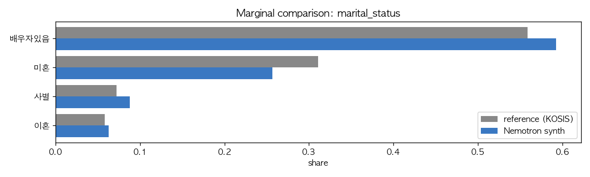
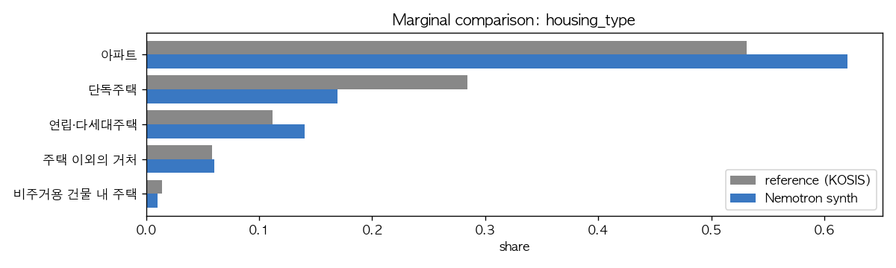
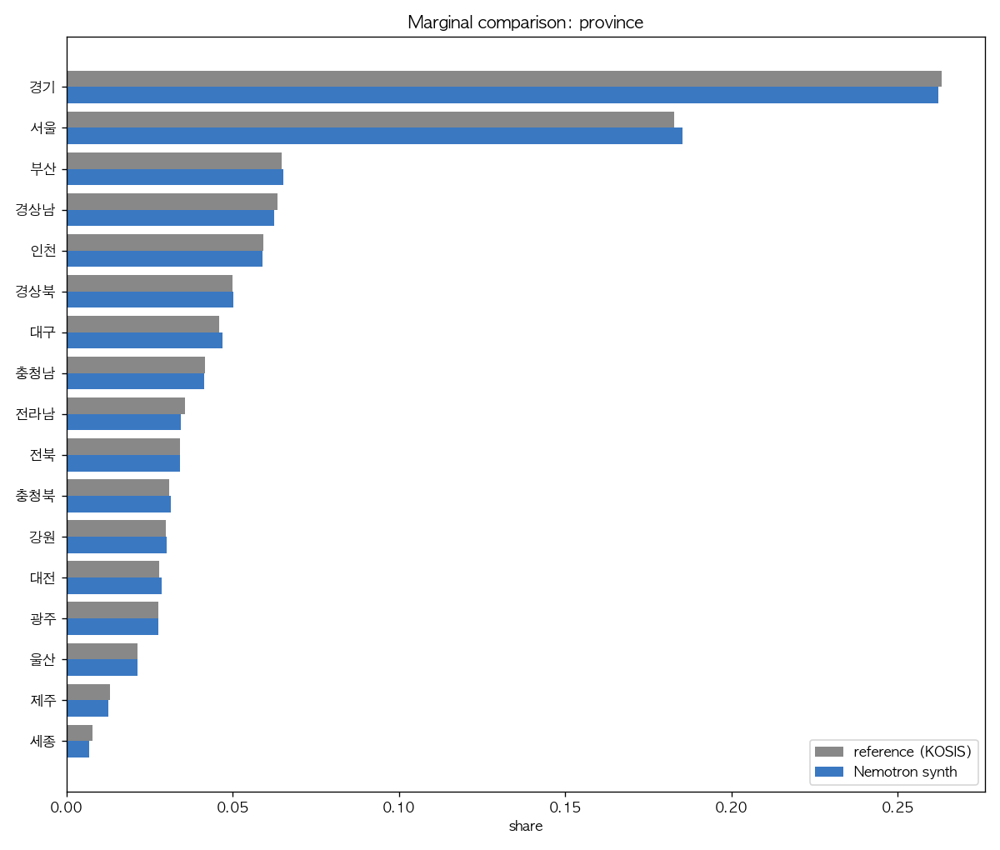
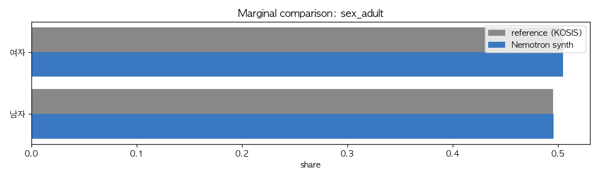
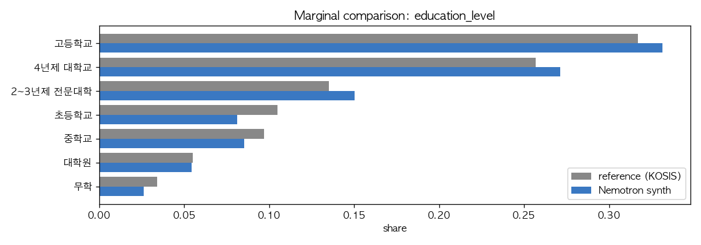

# KOSIS / 통계청 reference 대비 marginal 비교

Phase 1: 단변량 충실도. TVD = 0.5·Σ|p_synth − p_ref|.

## marital_status
- Reference: 통계청, 2020 인구주택총조사 · 15세 이상 인구 · 2020
- Caveat: Nemotron 모집단은 19세 이상이라, 미혼은 본 수치보다 낮고 배우자있음/사별은 높은 방향으로 자연스럽게 차이가 발생함.
- **TVD = 0.0540**, L∞ = 0.0540, χ² = 15274.3 (df=3, p=0.00e+00)

| category | reference | synth | diff (pp) |
|---|---:|---:|---:|
| 배우자있음 | 55.90% | 59.25% | +3.35 |
| 미혼 | 31.10% | 25.70% | -5.40 |
| 사별 | 7.20% | 8.79% | +1.59 |
| 이혼 | 5.80% | 6.26% | +0.46 |

## housing_type
- Reference: per-person 거처 분포 (자체 추정) — 통계청 2023 인구주택총조사 일반가구 분포에 1인가구 비중 35.5% · 1인가구 거처분포 · 평균 가구원수 2.21 로 가구원수 가중치 적용. Nemotron 데이터가 개인 단위 (1M 행 = 1M 명) 이므로 가구 단위 reference 와 직접 비교 불가하여 person-basis 로 변환.
- Caveat: 공식 per-person 통계가 별도 발표되지 않아 본 분석 자체 추정 (±2pp 정도 오차 가능). 다인가구 평균 가구원수를 거처유형별로 다르게 두지 않은 근사.
- **TVD = 0.0837**, L∞ = 0.080

| category | reference | synth | diff (pp) |
|---|---:|---:|---:|
| 아파트 | 58.60% | 62.06% | +3.46 |
| 단독주택 | 24.90% | 16.92% | -7.98 |
| 연립·다세대주택 | 11.00% | 14.01% | +3.01 |
| 주택 이외의 거처 | 4.00% | 6.03% | +2.03 |
| 비주거용 건물 내 주택 | 1.30% | 0.99% | -0.31 |

단독주택 -8pp 잔존 격차가 가장 큰 차이 — per-person reference 추정 오차 (±2pp) 고려 시 단언적 결론 어려움. 산출 방법: `scripts/20_housing_unit_correction.py`.

## province
- Reference: 행정안전부, 주민등록인구현황 2024.12 (KOSIS) · 총인구(주민등록인구) · 2024
- Caveat: 본 수치는 전 연령 합계. 19세+ 분포는 시도별 고령화 차이로 미세하게 다를 수 있으나(특히 세종/경기 청년층 비중이 높아 19+ 비중은 약간 낮을 수 있음) 큰 그림은 동일.
- **TVD = 0.0055**, L∞ = 0.0024, χ² = 285.9 (df=16, p=0.00e+00)

| category | reference | synth | diff (pp) |
|---|---:|---:|---:|
| 경기 | 26.31% | 26.22% | -0.09 |
| 서울 | 18.29% | 18.52% | +0.24 |
| 부산 | 6.48% | 6.53% | +0.05 |
| 경상남 | 6.34% | 6.24% | -0.10 |
| 인천 | 5.92% | 5.90% | -0.02 |
| 경상북 | 4.99% | 5.03% | +0.04 |
| 대구 | 4.60% | 4.69% | +0.10 |
| 충청남 | 4.17% | 4.15% | -0.03 |
| 전라남 | 3.58% | 3.44% | -0.14 |
| 전북 | 3.42% | 3.42% | -0.01 |
| 충청북 | 3.09% | 3.13% | +0.04 |
| 강원 | 3.00% | 3.02% | +0.02 |
| 대전 | 2.80% | 2.86% | +0.07 |
| 광주 | 2.77% | 2.76% | -0.01 |
| 울산 | 2.14% | 2.13% | -0.01 |
| 제주 | 1.31% | 1.27% | -0.05 |
| 세종 | 0.79% | 0.69% | -0.09 |

## sex_adult
- Reference: 통계청 추계인구 · 19세 이상 인구 · 2024
- Caveat: 고령층 여성 우세로 성인 인구는 여성이 약간 많음.
- **TVD = 0.0006**, L∞ = 0.0006, χ² = 1.2 (df=1, p=2.64e-01)

| category | reference | synth | diff (pp) |
|---|---:|---:|---:|
| 여자 | 50.50% | 50.44% | -0.06 |
| 남자 | 49.50% | 49.56% | +0.06 |

## education_level
- Reference: 통계청, 2020 인구주택총조사 표본집계 (학력별 인구) · **25세 이상** 인구 · 2020
- ⚠ **모집단 mismatch 주의**: Nemotron 은 **19세+**, reference 는 **25세+**. 19-24세 코호트는 (a) 평균 학력이 더 높고 (4년제·전문대 진학자 다수) (b) 재학 중인 경우 '진행 중' 학력으로 잡히기 때문에, Nemotron 에서 4년제·전문대 비중이 약간 높고 초등·중학교 비중이 약간 낮게 나오는 것은 **모집단 차이로 자연 발생하는 차이**.
- **TVD = 0.0439** — 모집단 mismatch 효과 고려 시 실질적으로는 매우 잘 부합.
- L∞ = 0.0238 (최대 셀 격차 2.4pp)

| category | reference (25+) | synth (19+) | diff (pp) | 19+ vs 25+ 자연 방향 |
|---|---:|---:|---:|:---:|
| 고등학교 | 31.70% | 33.14% | +1.44 | ↑ 자연 |
| 4년제 대학교 | 25.70% | 27.13% | +1.43 | ↑ 자연 |
| 2~3년제 전문대학 | 13.50% | 15.02% | +1.52 | ↑ 자연 |
| 초등학교 | 10.50% | 8.12% | -2.38 | ↓ 자연 |
| 중학교 | 9.70% | 8.53% | -1.17 | ↓ 자연 |
| 대학원 | 5.50% | 5.43% | -0.07 | ≈ |
| 무학 | 3.40% | 2.63% | -0.77 | ↓ 자연 |

→ 모든 격차의 부호가 **19+ vs 25+ 모집단 차이로 예상되는 방향과 일치**. NVIDIA 측 modeling 오차가 아닌 정의 차이로 해석됨.

